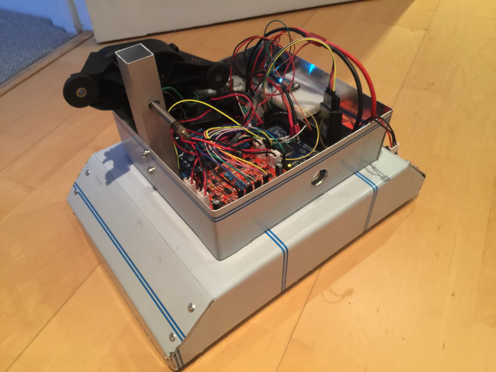
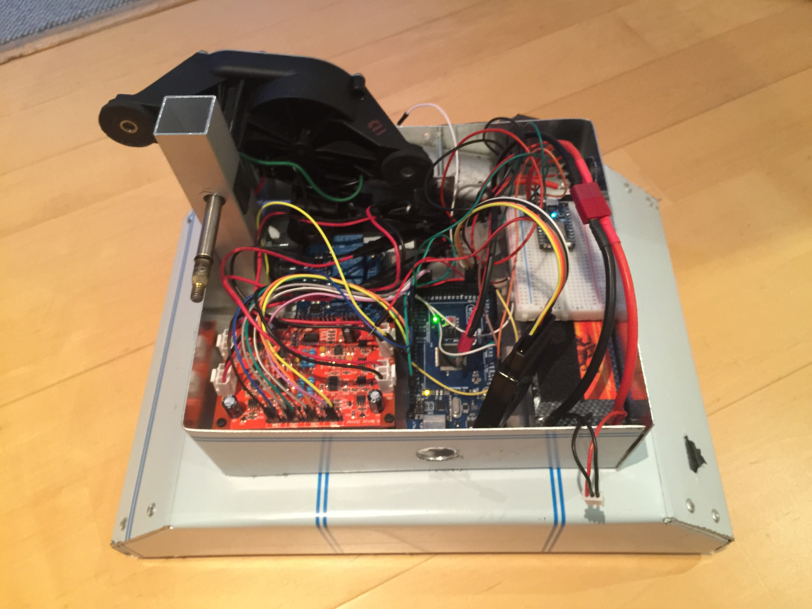

 

# [Battlebot with Flipper](https://nrobinson2000.github.io/battlebot/)
I created during Grade 10 for Tech Club. It uses a Particle Electron and an Arduino Mega to control a Rover 5 chassis and a Fiat Punto windshield wiper motor.  The Electron has 3G and receives commands form the app I created.  It then relays these commands to the Mega, which then either controls the motor controller board to move the robot, or the relay board to trigger the robot's weapon.  The motor controller board, Mega, and Electron are are powered from a 7.4 volt 5200 mAh Li-po battery.  The weapon is powered by a 11.1 volt 2200 mAh Li-po battery.  The Electron also uses its own 3.7 volt 2000 mAh battery for keeping its cellular connection.

## Controls
<strong>Click - Photon - or - Electron  - to select your robot.</strong> Use the sliders above to set each motor to its individual desired direction and speed.  Click <code>GO</code> to apply.  Click <code>STOP</code> to make the robot come to a complete stop.  Click <code>FORWARDS</code> or <code> BACKWARDS</code> to quickly make the robot move in the desired direction.  Click <code>CLOCKWISE</code> or <code>COUNTERWISE</code> to quickly make the robot rotate in the desired direction.

## Desktop Controls
To make the robot move forwards, press the <code>UP ARROW</code>.  To move backwards. press the <code>DOWN ARROW</code>.  To turn right, clockwise, press the <code>RIGHT ARROW</code>. To turn left, counterclockwise, press the <code>LEFT ARROW</code>. Press <code>SHIFT</code> to stop the robot's movement.  Press <code>ENTER</code> to toggle the robot's weapon.

